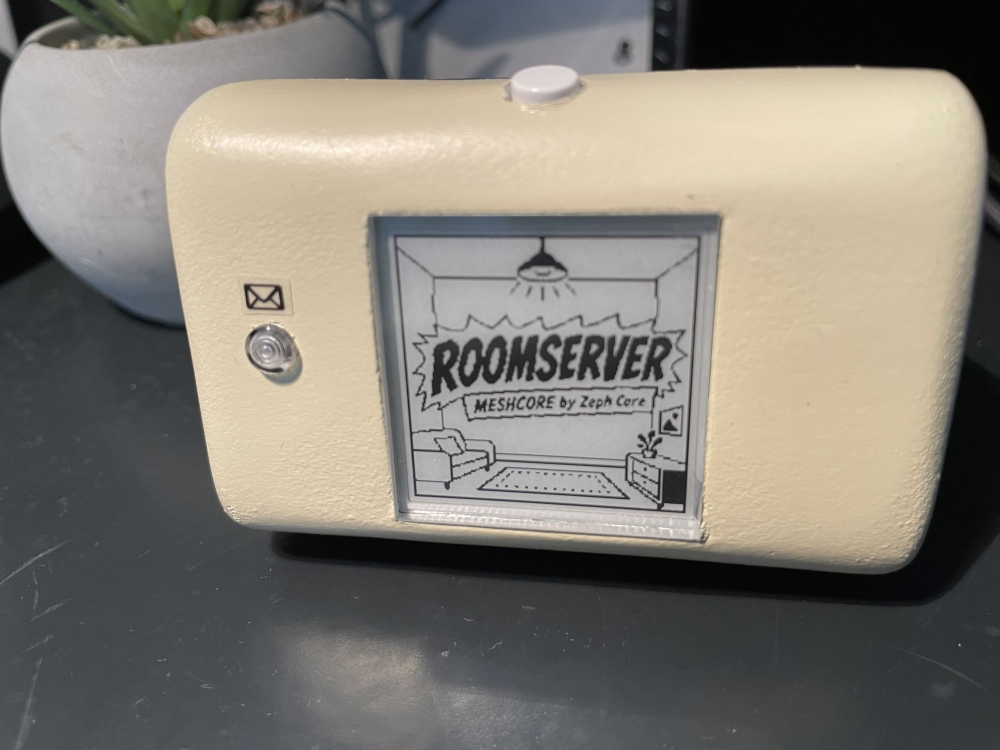
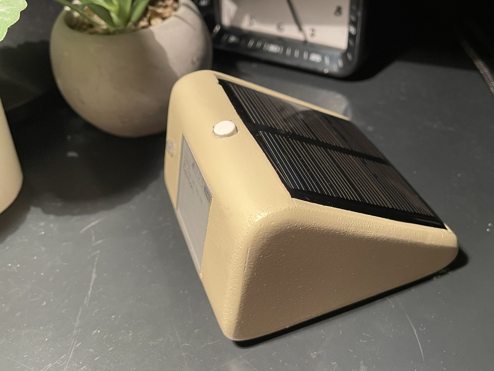
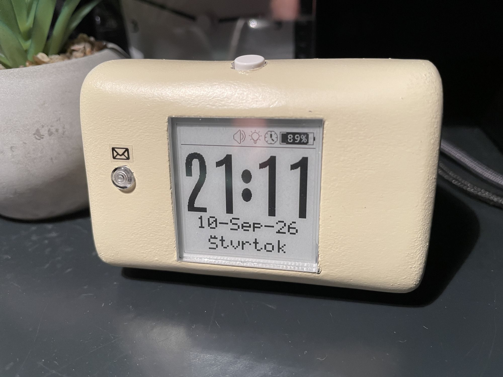
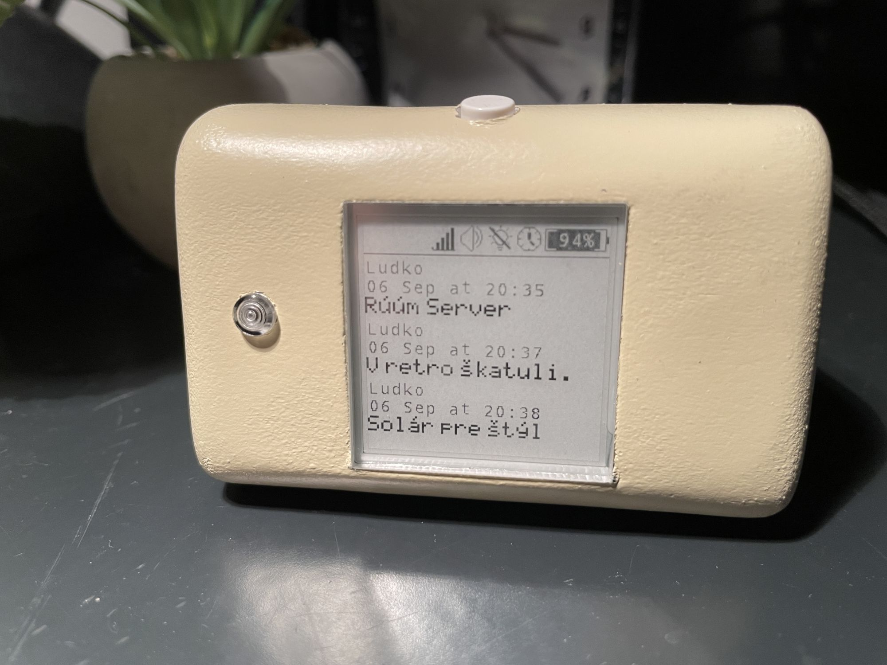
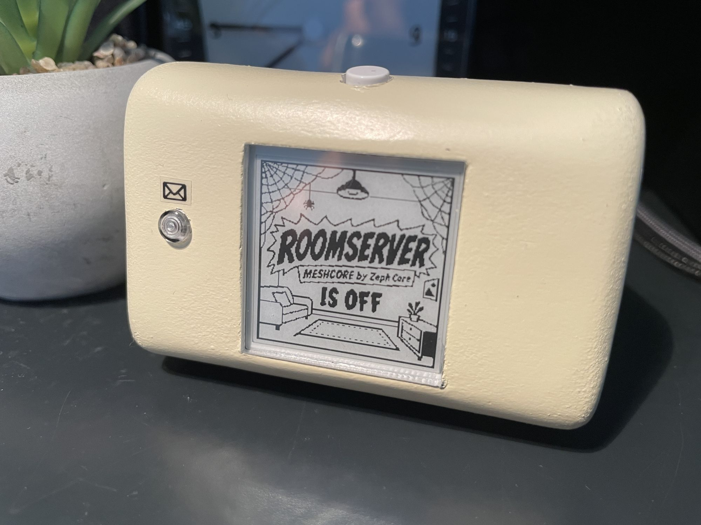

# MESHCORE Room Server – XIAO BLE + E-paper Display

Standalone room server with an e-paper display, running on a modified ZephCore.

## Overview

This project is a standalone room server based on **MESHCORE**, using a **Seeed Studio XIAO nRF52840** with an **e-paper display**.

The device is designed to operate as a room server and provide status information through the e-paper display.

## Features

* Standalone MESHCORE room server
* Seeed Studio XIAO BLE / nRF52840
* E-paper display
* Modified ZephCore firmware
* Low-power display
* Compact hardware design
* Room status and messages displayed locally
* Clock and date display
* Alert LED with NEOPIXEL

## Hardware

* Seeed Studio XIAO nRF52840
* E-paper display 1,54"
* MESHCORE-compatible hardware

## Images

### Room 0

### Room 1

### Room 2

### Room 3

### Room 4

## Firmware

The room server runs on a modified version of **ZephCore** adapted for this project.

## Status

Work in progress.

More information, documentation and hardware details will be added as the project develops.

## License

See the repository for license information.
